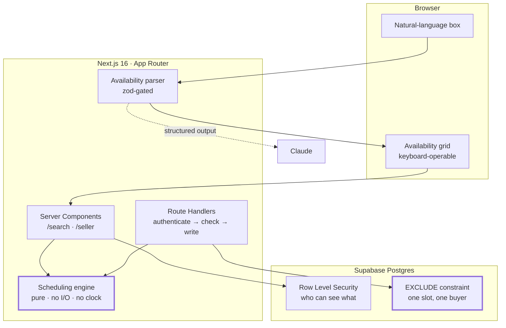

# The Day Book

**A two-sided home showing scheduler.** Sellers write down the hours their house
can be seen. Buyers write down the hours they are free. The only listings a
buyer sees are the ones with a real opening inside their week, and the slot
books on the spot.

Built as a one-day challenge. The interesting part is not the CRUD — it is that
"when can both of these people be at this house" is a genuinely hard question
once timezones, daylight saving, turnaround buffers and two people pressing
*Book* at the same moment are all real.

> **Live demo:** _(link goes here)_ — two one-click doors on the front page, no
> sign-up. Every listing, address, price and person in it is invented.

---

## Contents

- [The 60-second tour](#the-60-second-tour)
- [Architecture](#architecture)
- [The three hard problems](#the-three-hard-problems)
- [Data model and authorization](#data-model-and-authorization)
- [Where AI is used, and where it deliberately is not](#where-ai-is-used-and-where-it-deliberately-is-not)
- [Testing strategy](#testing-strategy)
- [Running it locally](#running-it-locally)
- [Trade-offs, and what I would do next](#trade-offs-and-what-i-would-do-next)

---

## The 60-second tour

**The landing page draws the mechanism instead of claiming it.** Two weeks slide
onto the same ruled line — the seller's open hours, the buyer's availability —
and where they cross is what can be booked. That drawing is the same component
the product uses on both sides.

**The seller's book.** One page per house: the week it is open, drawn on that
same rule, with the showings written underneath it. Showing length, the gap
between showings, how far ahead buyers can book, and minimum notice are all per
listing.

**The buyer's week.** Type *"weekday evenings after 6, and Saturday mornings"*
and Claude fills in the grid; or fill the grid in directly. Either way the grid
is what runs. Results come back sorted by how much of each listing lands inside
your week, every slot labelled with its date, time and timezone in both clocks
when the house is somewhere else. Booking prints a carbon duplicate — the buyer
keeps one half, the seller's book has the other.

---

## Architecture



| Layer | Choice | Why |
|---|---|---|
| Framework | Next.js 16, App Router | Server Components let the match run next to the data; the engine's inputs never ship to the browser |
| Database | Supabase Postgres | RLS and `EXCLUDE` constraints are the two features this problem actually needs, and both are Postgres, not Supabase |
| Validation | zod v4 | One schema at every boundary: the URL, the API body, and the model's output |
| Styling | Tailwind v4 | Design tokens live in CSS custom properties; see [`DESIGN.md`](DESIGN.md) |
| Model | Claude Sonnet 5, structured output | One narrow job, described below |

The engine (`src/lib/scheduling/`) is the centre of gravity and has no
dependency on any of the above. It takes numbers and returns numbers.

---

## The three hard problems

### 1. A window is wall-clock time, not an instant

A seller says *"Saturdays, 10 till 2."* That is not a time — it is a time **in
the property's timezone**, and its UTC offset changes twice a year.

The classic bug is expanding one week and adding `7 * 24 * 60 * 60 * 1000` for
the next. Every listing silently shifts by an hour twice a year. So the
expansion walks the **civil calendar** and re-resolves the offset on each date:

```ts
// src/lib/scheduling/windows.ts
for (const date of civilDatesBetween(first, last)) {
  if (blackout.has(formatCivilDate(date))) continue;
  const dayRules = rulesByDay.get(dayOfWeekOf(date));

  for (const rule of dayRules ?? []) {
    const start = Math.max(zonedInstant(date, rule.startMinute, timeZone), from);
    const end   = Math.min(zonedInstant(date, rule.endMinute, timeZone), to);
    if (end > start) intervals.push({ start, end });
  }
}
```

Two DST edges fall out of this, and both are tested:

- **Spring forward.** A 01:00–04:00 window on the day the clocks skip 02:00 is
  **two real hours**, not three, and only two hours of slots are offered.
- **Fall back.** 01:30 happens twice. Both boundaries resolve to the **later**
  occurrence, so the repeated hour is **skipped rather than offered twice**.
  That is the safe direction to be wrong in: offering it twice would put a
  buyer and a seller an hour apart while both read "01:30" on their screens.

The offset resolution is computed here rather than delegated to a date library,
and that was not the original design — CI taught it. The first version used a
library's `TZDate`, and the fall-back test returned **three hours on Windows and
four on Linux**: behaviour at an ambiguous local time is an implementation
detail that moves with the platform's ICU build. A rule the product depends on
has to be written down inside the product, so `zonedInstant` now probes the
offsets either side of the wall time, keeps only candidates that read back as
the requested local time, and picks deterministically. There is a test asserting
that policy directly, not inferring it from a window's length.

The buyer's availability is expanded in the **buyer's** timezone, and the two
results are intersected as instants. A buyer in New York genuinely cannot make a
10:00 Denver showing before noon their time, and the app says so on the slot.

### 2. Slots are cut from the window, then filtered — never the reverse

Given free time, the obvious move is to slice it into slots. It is wrong, and a
test caught it:

> Book 10:00–10:30 on a house with a 15-minute buffer. Free time is now
> 09:00–09:45 and 10:45–12:00. Slice *that* and the next offer is **10:45**,
> then 11:15 — times on nobody's calendar, which move again with the next
> booking.

So candidates are cut from the seller's window, giving a stable grid, and then
filtered: inside the bookable horizon, clear of every booked showing **grown by
the buffer**, and inside the buyer's availability. A slot that only partly fits
is not bookable.

Buffers are applied **before** the fit check rather than after, so the engine
never offers a slot that the database's overlap constraint would then reject.
The offer and the guarantee agree.

### 3. Two buyers, one doorstep

Read-then-insert cannot fix this. There is always a window between the read and
the insert where both requests are in flight, and no amount of application-level
"is it still free?" closes it. So the guarantee lives in the one place both
transactions must pass through:

```sql
alter table showings
  add constraint showings_no_overlap
  exclude using gist (
    listing_id with =,
    tstzrange(starts_at, ends_at) with &&
  ) where (status <> 'canceled');
```

Whichever transaction commits second raises `23P01`; the route turns that into a
**409** and tells the buyer the slot just went, which is true. `tstzrange` is
half-open, matching the engine's intervals, so back-to-back showings stay legal
in both. Cancelled rows are excluded, so cancelling genuinely frees the slot.

The API still re-runs the engine before inserting, because the two checks catch
different things: without the engine check a buyer could POST 03:00 on a Tuesday
and get a showing the seller never opened; without the constraint, two valid
requests both succeed. Both, in that order.

---

## Data model and authorization

```
profiles ──< listings ──< showing_windows      (weekly, wall clock, no offset)
                    ├──< blackout_dates        (civil dates in the house's zone)
                    └──< showings              (timestamptz instants)
```

Authorization is **Row Level Security**, not application code. Every route is
written as though it might have a bug in it; the policies are what actually
holds:

- A seller writes only their own listings, windows and blackouts.
- Published listings are readable by anyone — a signed-out visitor can browse,
  which is how `/search` works without an account. **Writes** are the boundary.
- A buyer reads only their own showings. One buyer can never read another
  buyer's name, note or schedule, which `buyer_note` makes a real privacy
  question rather than a theoretical one.
- **A signed-out visitor can see *that* a slot is taken, never *who* took it.**
  Search needs booked intervals in order to subtract them, but `showings`
  carries `buyer_id` and `buyer_note`. So busy times have their own view
  exposing three columns and nothing else. It runs as its owner and reads past
  RLS — which is exactly why adding a column to it is a privacy decision, and
  why a pgTAP test fails if one identifying a buyer ever appears there.
- Table-level privileges are revoked before anything is granted back. In
  Postgres privileges add up: a later table-wide `GRANT` silently widens a
  narrow one, and revoking a column afterwards subtracts nothing from it.

Showings are never hard-deleted. Cancelling is a status change, so the record of
who booked what survives — and no `DELETE` is granted on `showings` at all.

---

## Where AI is used, and where it deliberately is not

**Used:** turning a sentence into structured availability.
`POST /api/availability/parse` sends the text to Claude with a forced tool call,
so the reply is structured output rather than prose to be scraped.

**Not used:** anything that decides what is bookable. Matching, slot generation,
buffers and conflict detection are deterministic code with tests. A model in
that path would make the core of the product untestable and occasionally wrong
about whether a stranger is coming to your house.

The boundary is enforced, not just intended:

| Guard | What it prevents |
|---|---|
| zod schema on the output | A hallucinated `dayOfWeek: 9` is **dropped**, not repaired |
| Result fills the grid, never commits | The buyer sees the reading and corrects it before any search runs |
| 400-character input cap | A pasted document becoming a bill |
| Rate limit + sign-in required | A public link turning into an invoice |
| No key ⇒ feature disables itself | The app is fully usable without `ANTHROPIC_API_KEY`; the grid was always there |

The in-memory rate limit is honest about its limits: serverless instances do not
share it, so it stops a stuck retry loop and a curious visitor, not a determined
one. That wants Redis, and it is a deliberate omission.

---

## Testing strategy

**78 unit tests**, plus database and browser layers. The split is deliberate:
`npm test` never needs Docker, so nobody is blocked from running it.

| Layer | Where | What it catches | Docker? |
|---|---|---|---|
| Unit + golden master | `src/**/*.test.ts` | DST transitions, buffer arithmetic, interval algebra, cross-timezone matching | No |
| pgTAP | `supabase/tests/*.test.sql` | RLS isolation and the overlap constraint, as the real `authenticated` and `anon` roles | Yes |
| End-to-end | `e2e/*.spec.ts` | The booking funnel, and two buyers racing for one slot | Yes |

Three things worth calling out:

- **`engine.golden.test.ts` is a golden master.** It freezes the whole pipeline
  on one scenario — two timezones, a DST transition, a blackout, a booking with
  a buffer, partial buyer overlap. When it fails, the question is not "how do I
  update the expected array" but "whose calendar just changed."
- **`rules.test.ts` parses the migrations.** The form's friendly bounds
  duplicate the database's `CHECK` constraints; the test reads the SQL and fails
  if the copies drift. Duplication that drifts is worse than no duplication.
- **Every fixture is deterministic.** These tests fail on a machine nobody logs
  into; a random fixture makes that failure irreproducible.

Four bugs in this repo were found by the test layers rather than by review, and
each one was found by the layer built to catch its kind:

| Found by | Bug |
|---|---|
| Unit test | Slots re-anchoring to surviving free time, so booking 10:00 moved every later slot to 10:45 |
| `tsc` | A `Database` type written with `interface` instead of `type`, failing supabase-js's `Record<string, unknown>` constraint and silently resolving **every** query to `never` |
| CI, on Linux | The DST fall-back resolution differing between platforms — see above |
| CI, end-to-end | A signed-out visitor could not search at all, because the query for booked times hit a table `anon` cannot read. The landing page invites exactly that visitor to browse. |

The last one is the argument for the end-to-end layer in miniature: every unit
test passed, every type checked, and the feature was broken for anybody without
an account.

---

## Running it locally

**Prerequisites:** Node 22+, Docker (for the local database only).

```bash
git clone <this repo> && cd one-day-build && npm install
```

```bash
cp .env.example .env.local
```

```bash
npx supabase start && npx supabase db reset
```

`supabase start` prints the local API URL and keys — put them in `.env.local` as
`NEXT_PUBLIC_SUPABASE_URL`, `NEXT_PUBLIC_SUPABASE_PUBLISHABLE_KEY` and
`SUPABASE_SECRET_KEY`. `ANTHROPIC_API_KEY` is optional; without it the
natural-language box turns itself off and the grid still works.

```bash
npm run seed && npm run dev
```

Then open <http://localhost:3200> and use either door on the front page.

**The checks:**

```bash
npm run typecheck && npm run lint && npm test
```

```bash
npx supabase test db
```

```bash
npm run test:e2e
```

---

## Trade-offs, and what I would do next

Scope decisions, stated rather than left looking like omissions.

**Deliberately not built.** Messaging between buyer and seller; payments; photo
upload; agent and brokerage hierarchy; email or SMS notification; recurring
showings; group open houses. Each is a day of work that would have come out of
the engine's correctness, and the engine is the product.

**Known gaps, honestly:**

- **A listing and its windows are two statements, not one transaction.** A
  failed second write leaves a listing with no windows — which shows to nobody
  and the seller can fix. A partial *booking* would not be survivable, and is
  not possible; this one is. The proper fix is a single RPC.
- **The rate limit is per instance.** Named above.
- **No observability.** An error in production leaves no trace anywhere. First
  thing I would add.
- **The seller cannot yet edit a listing or add blackout dates through the UI.**
  The engine, the schema and the API all support blackouts, and the seed uses
  them; the form does not expose them.

**Next, in order:** the listing-creation RPC, so the two writes are one; editing
and blackout management for sellers; Sentry; then notifications, which is the
first thing a real seller would ask for and the first thing that needs a queue.

---

## Repository map

```
src/lib/scheduling/     the engine — pure, no I/O, 78 tests live against it
src/lib/ai/             the availability parser and its zod gate
src/lib/search.ts       DB rows → engine inputs → matched listings
src/app/api/            Route Handlers: authenticate → check → write
src/components/         the ruled week, the availability grid, the slip
supabase/migrations/    the schema, RLS policies, and the EXCLUDE constraint
supabase/tests/         pgTAP: isolation and the race
e2e/                    the booking funnel and the race, in a browser
PRODUCT.md DESIGN.md    product truth and the visual system
```
